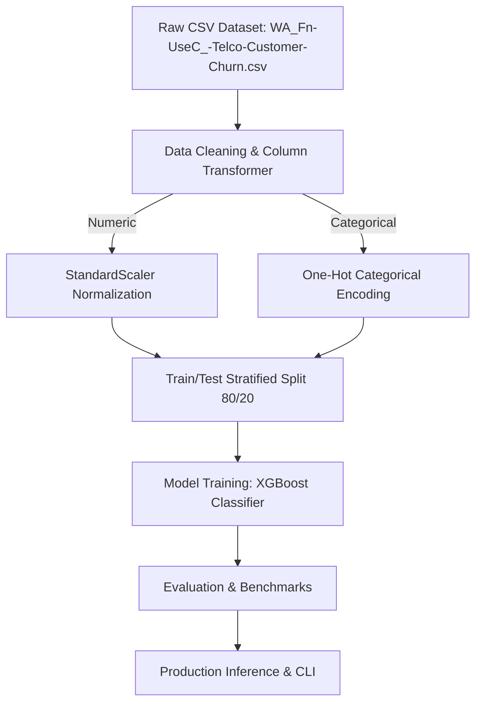

# Telco Customer Churn & Retention Analytics Platform - Architecture & Pipeline Design

## Comparative Models Evaluated
- **XGBoost Classifier**
- **Random Forest**
- **Logistic Regression**
- **LightGBM**
